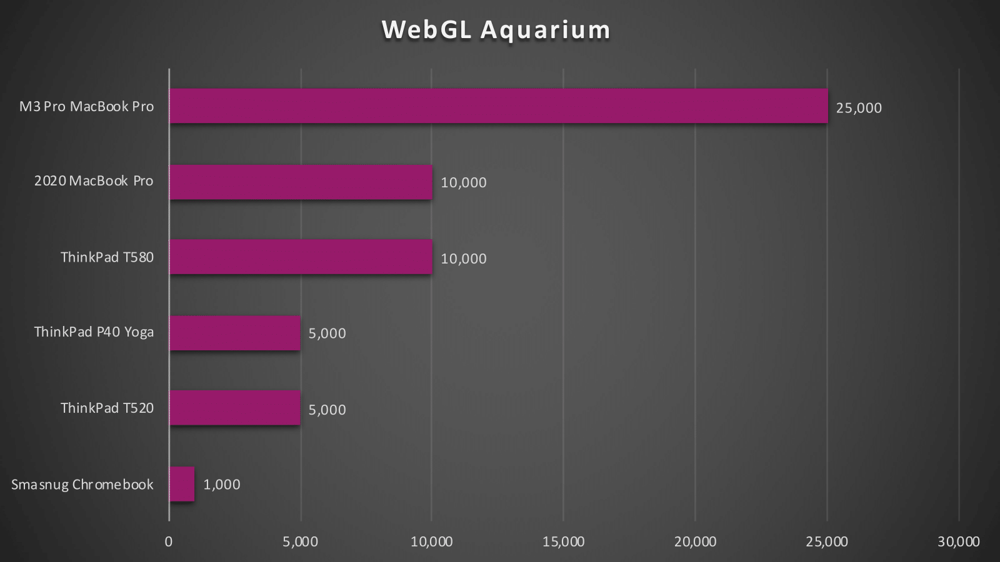
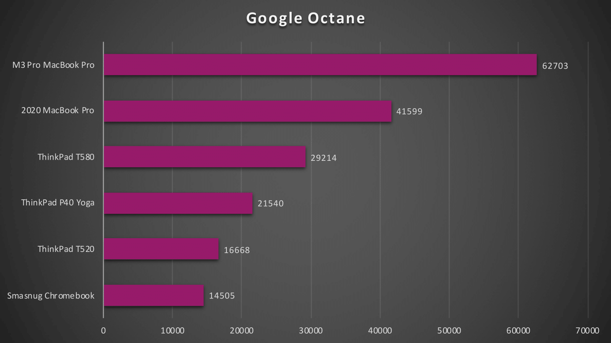
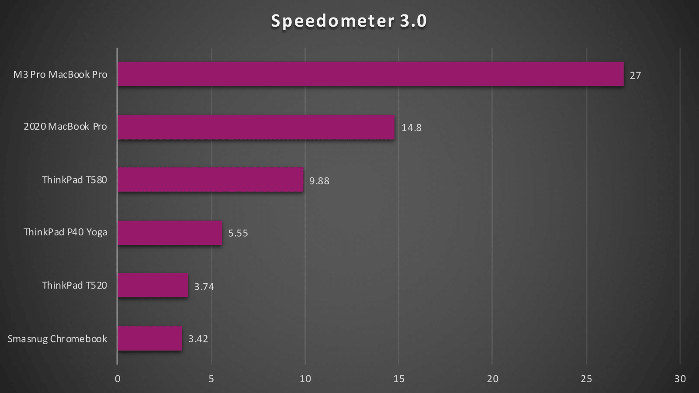
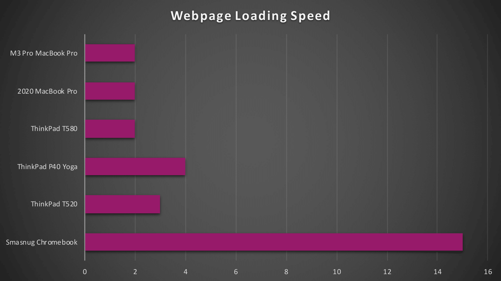
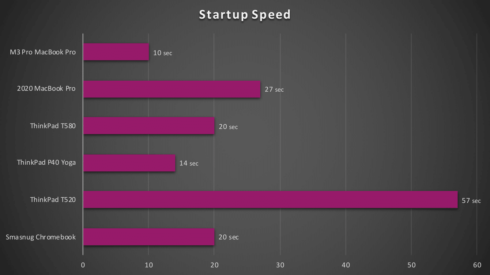
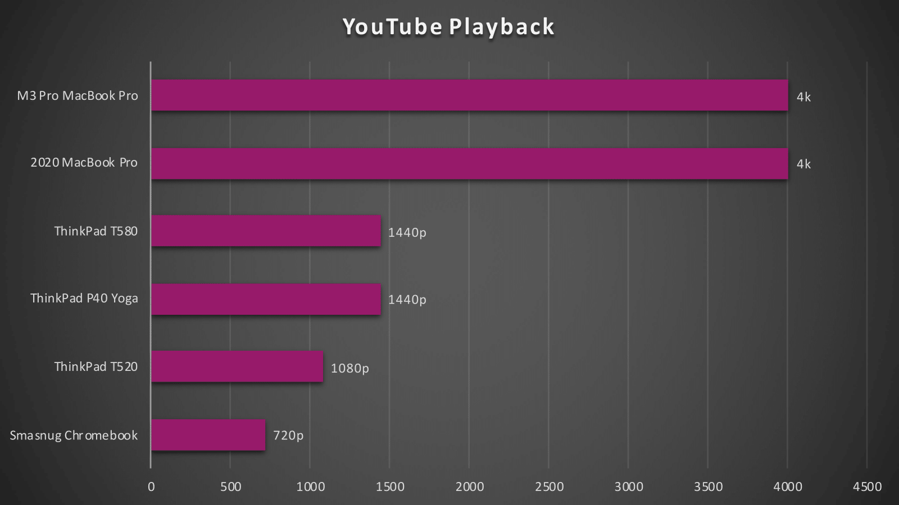
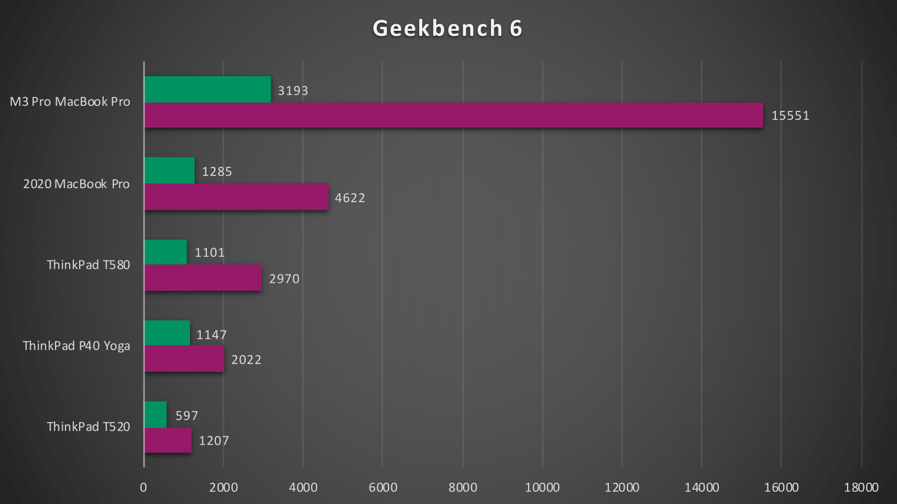

# Chromebook vs. the world
I've never been much of a fan of Chromebooks, so I decided to compare my school issued chromebook to ThinkPad T520 from 2011.
## Watch the Video

#### If you haven't come here from the video, you should really watch it!

<lite-youtube videoid="Jj9wPObPrmA"/>

## WebGL Aquarium

This one's pretty basic, so I was kind of impressed that the Chromebook only made it to 1,000 fish. The ThinkPad T520 Looks like it's stealing candy from a baby

## Google Octane

I know Octane is a bit out of date at this point, but it seemed fair to test a Chromebook with Google's own benchmark

## Speedometer 3.0

The spiritual successor to Octane

## Webpage Loading Speed

This is a device literally made to browse the web, and it can bareley even load the New York Times.

## Startup Speed

Not a surprise here that the Thinkpad took the longest, given that it's the only tested machine with a spinning hard drive.

## YouTube Playback

Literally the bare minimum 

# The Real Laptops
#### I was curious about the performence differences between all the non-chromebooks
## Geekbench 6

Just remember that often times, benchmarks such as Geekbench don't actually show real world performance. The main thing to remember is that multi-core is almost always more important in productivity tasks like web browsing. 
